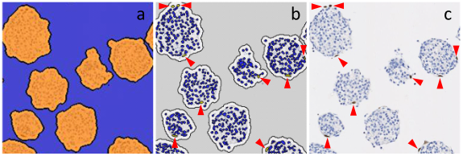
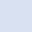
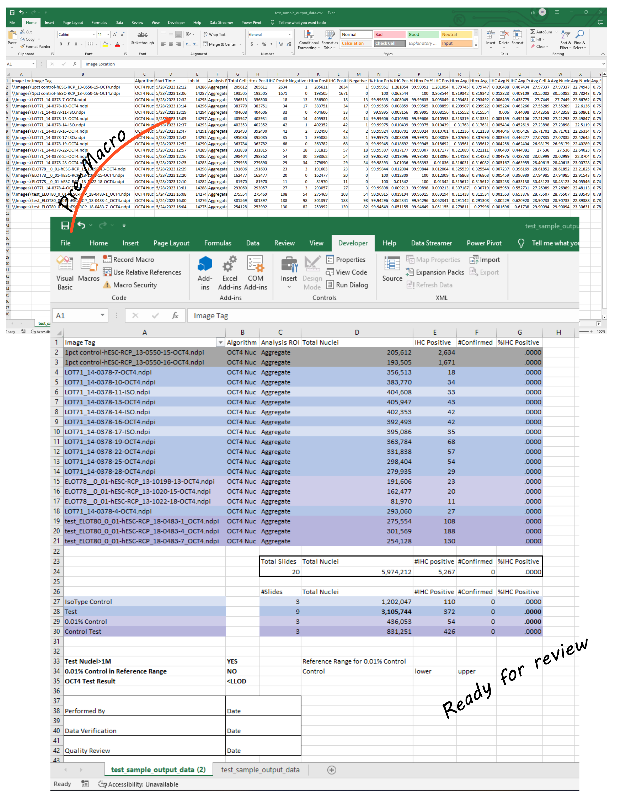

# VBA Data Handler for HALO AI image analysis: Drug Substance lot release for Clinical Trial

A VBA macro to transform raw image-analysis output from HALO AI into a QA-ready report. The assay is a rare-cell detection analysis over millions of cells to regulatory rigor. The assay is in support of clinical trial for a first-in-human stem cell therapy for Type 1 Diabetes. It is the second-generation quantitation assay that succeeded the original qualified Definiens Tissue Studio assay.

## Clinical context

The cell therapy Drug Substance (DS) is a pancreatic endoderm cell product manufactured from pluripotent human embryonic stem cells (hESC) as starting material and delivered as cryopreserved cell aggregates.

Pluripotent cells can form teratomas.

The lot release safety case requires demonstrating DS purity; that any residual undifferentiated stem cells in the final product fall below a tumorigenicity-relevant threshold established through animal studies and histology research. OCT4 (POU5F1) is a nuclear transcription factor expressed in pluripotent cells. Quantitating OCT4-positive nuclei in IHC stained sections of DS is the assay that establishes the safety case.

The same biology that makes pluripotent cells useful makes them dangerous if they persist in numbers to the final product. Without demonstrating DS purity, we would not put these cells into people, nor would we be allowed to do so if we tried. This is a cooperation arrangement between regulatory authority and a biomedical research company working for the safety benefit of patients.

*Closeup example of IHC staining, positive nuclei at arrowheads. Panel a is ROI selection of aggregates, b panel is nuclear classification.  One slide can contain 500,000 nuclei*

## What the macro does

Transforms the slide analysis output CSV from HALO AI and produces a clear QA-ready report:

- Strips the analysis-parameter columns and retains regulatory-relevant fields
- Color-codes each slide-id by sample type (control type, test type) using substring matches on the Image Tag
- Builds a master subtotal row to extract auto-filtered per-category totals
- Provides color-coded per-category summary results that the QA reviewer generates then populates in the result fields, making the reviewer the explicit signer of the data
- Generates the three reportable results (sample size check, in-range positive control verification, final test result classification) as live formulas
- Lays out the signature block (Performed By / Data Verification / Quality Review)

### The four controls

The color logic reflects the control structure of the upstream assay. Each color is a different control or test in the assay. These controls are part of the histology pipeline, not the image-analysis algorithm.

> **Note:** RCP is Reaggregated Cell Product. Positive controls did not exist for this kind of assay, so I made some. Using serial dilutions of hESC, I spiked known quantities into our DS. This mimics the presence of a specific dose of undifferentiated cells in the DS. This is made of live cells that are cryopreserved until needed.

**1% hESC-RCP positive control (assay control).** One control slide is included in every IHC staining tray (the stainer holds three trays of ten slides each). At 1% positive nuclei staining should be uniform across the section. If it is not, the entire tray is rejected. This is the staining go/no-go. In the macro, these slides receive a grey fill and are not aggregated into the test results; they're sentinels for whether the upstream IHC process produced analyzable material.

**0.01% hESC-RCP in-range positive control.** A sham drug substance manufactured to a defined positive percentage. Each image-analysis run requires the 0.01% control to fall within its own pre-established reference range; if it doesn't, the entire run is rejected. The macro runs an explicit YES/NO formula for this control.

> **Note:** the reference range is established as a ride-along assay that shows up as "Control Test" in a normal assay run. Control Test is run 5 times for each 0.01% control lot.

**Isotype control (negative control).** A non-specific antibody on the same sample background. By definition, any positive here is a false positive. Establishes the noise floor, which is hopefully zero.

**Test slides (LOT#).** The actual product samples. The reportable result is computed only after the assay control passes, the in-range positive control falls in range, and the isotype control behaves as expected. The macro classifies the final percentage into one of three regulatory categories: below the lower limit of detection (LLOD), below the lower quantitation limit 0.0011%, or the actual numeric value if there is meaningful positivity.

*Raw csv output from HALO AI and macro converted to review-friendly layout*

*Ready for print and sign. Reviewer inputs confirmed positive nuclei then filters by fill clour to extract summary data for the analysis. QA wants to know if enough nuclei were lookedat, whether the 0.01% positive control is within its reference range, and what the test result is. These are laid out right about the signature box*

### The System Suitability Check Image (montage)

There's a fifth thing the assay validates that isn't a sample at all. The System Suitability Check Image, the montage, is a single composite image containing every kind of weirdness the histology threw at us, with known analysis outcomes. Debris, literal edge cases from the edge of the glass slide, staining anomalies, duplicate objects, ambiguous objects were all included on this test image.

It was analyzed at the start of every Tissue Studio assay run. If the ML doesn't produce the expected counts on the montage, the analysis is rejected before any slide data are read out.

This is in-assay adversarial validation. The algorithm doesn't get to decide it had a good day. Every session is gated on the algorithm correctly handling a deliberate edge-case battery before any clinical data are touched. I built this into the assay as an attempt to break it...now I know what red-teaming is and have a name for the fun.

## Conservative design

The assay is intentionally tuned to over-call candidate positive nuclei. Losing true positive nuclei to an overly stringent threshold is catastrophic and means underestimating teratoma risk. So we chose to have the algorithm call generously, then have a human visually verify each call. The macro's `#Confirmed` column is where the human-verified counts go. The reportable percentage uses the verified count divided by total nuclei.

This is the right shape for AI/ML in a regulated patient-safety context: machine-augmented, not machine-autonomous. The asymmetry of error costs is baked into the algorithm's tuning.

## Why this is in my portfolio

The original macro built in 2014–2015 was the end piece of a regulated pipeline that anchored the safety case for a first-in-human cell therapy. This initial project included: a classical computer-vision algorithm (Tissue Studio / Random Forest) tuned for asymmetric error costs, an in-assay system suitability check that validated the AI per session against an adversarial edge-case battery, a four-control architecture that gated reportable results on multiple independent failure modes, and a human-in-the-loop verification step that made the reviewer the signer of every transcribed number.

When I upgraded the assay for use in Indica Labs HALO AI (DenseNet CNNs) I carried forward the foundational regulatory logic and deployed a better assay. The upgraded version no longer needed a System Suitability Check Image because the algorithm had improved and the reporting was more streamlined, which the QA team welcomed. The lifecycle of this assay through its transitions was 2014 to 2024 when our company was absorbed by acquisition.

The whole pattern of adversarial pre-deployment validation, per-run ML behavior checks, conservative tuning aligned to safety-relevant error asymmetry, human verification of AI calls is what we now talk about as the right shape for deploying aligned AI in high-stakes settings.
